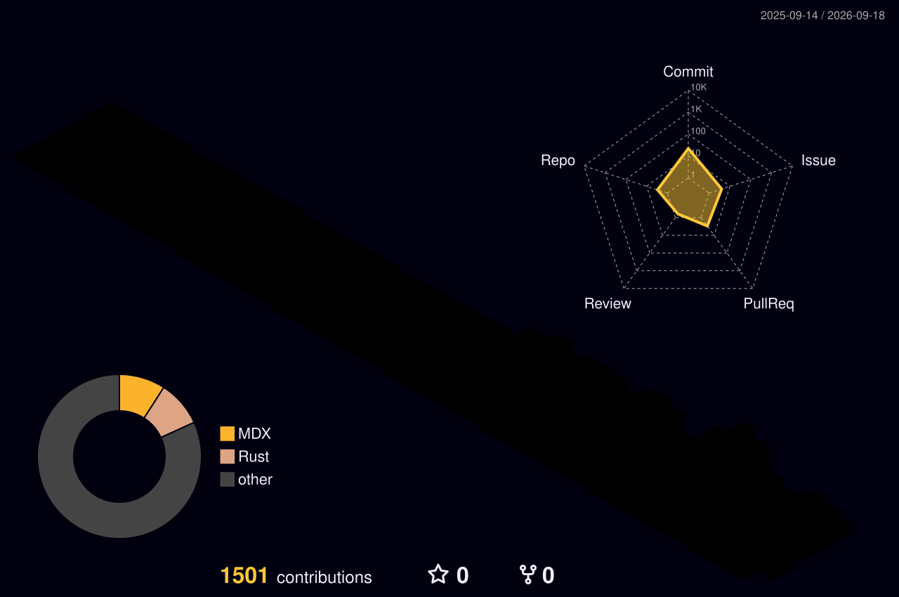

<div align="center">


</div>

<div align="center">


</div>

<br/>

<div align="center">

[](https://github.com/fallenmaverick)
[](https://github.com/fallenmaverick?tab=followers)
[](https://github.com/fallenmaverick?tab=repositories)
[](https://linkedin.com/in/maverick-cloud)
[](https://linkedin.com/in/maverick-cloud)

</div>

---

<div align="center">

### 🌌 3D Contribution Calendar



</div>

---

<div align="center">

```
┌─────────────────────────────────────────────────────────────────────┐
│  ⚡  aashutosh@maverick  ~  zsh                             [root]  │
├─────────────────────────────────────────────────────────────────────┤
│                                                                     │
│  $ whoami                                                           │
│    → Aashutosh Desale  ·  Bootstrapped Founder & CEO               │
│                                                                     │
│  $ cat passion.txt                                                  │
│    → Building AI-native SaaS that eliminates human toil            │
│                                                                     │
│  $ ls expertise/                                                    │
│    cloud-infra/   distributed-systems/   ai-agents/   saas/        │
│                                                                     │
│  $ echo $PHILOSOPHY                                                 │
│    → "Ship fast. Iterate faster. Never stop building."             │
│                                                                     │
│  $ uptime                                                           │
│    → 4+ years in production  ·  55+ repos  ·  0 regrets           │
│                                                                     │
│  $ echo $STATUS                                                     │
│    → 🚀 Heads-down. Zero to one. No days off.                      │
│                                                                     │
└─────────────────────────────────────────────────────────────────────┘
```

</div>

---

## 🧑‍💻 About Me


<br/>

- 🚀 &nbsp; Bootstrapped founder — shipping **production SaaS** from 0 to revenue
- ☁️ &nbsp; Deep expertise in **cloud infrastructure**, distributed systems & async architecture
- 🤖 &nbsp; Building **AI-native tools** that automate what humans shouldn't have to do
- 🧠 &nbsp; Obsessed with **developer experience**, clean APIs, and systems that scale silently
- 🌏 &nbsp; On a mission to ship **India-first software** that competes globally
- 💬 &nbsp; Ask me about  **Python**,  **FastAPI**,  **Next.js**, cloud cost & SaaS architecture
- ⚡ &nbsp; Fun fact: I debug with `print()`, ship on Fridays, and sleep fine

<br/><br/><br/><br/>

<div align="left">

| 🏗️ Building | ☁️ Cloud | 🎯 Stage | 📍 Base |
|:---:|:---:|:---:|:---:|
| SaaS + AI Agents | AWS / Cloud-Native | Bootstrapped, Revenue-Focused | India 🇮🇳 |

</div>

---

## ⚡ What I Specialize In

<table width="100%">
  <tr>
    <td align="center" width="33%">
      <br/>
      
      <br/><br/>
      <strong>⚙️ Backend Engineering</strong>
      <br/><br/>
      <sub>High-throughput APIs · Async task pipelines · Worker queues<br/>REST · Auth flows · Multi-tenant systems · SQLAlchemy</sub>
      <br/><br/>
    </td>
    <td align="center" width="33%">
      <br/>
      
      <br/><br/>
      <strong>☁️ Cloud & DevOps</strong>
      <br/><br/>
      <sub>AWS · Docker · Redis · PostgreSQL · CI/CD<br/>Infrastructure automation · Cost intelligence · FinOps</sub>
      <br/><br/>
    </td>
    <td align="center" width="33%">
      <br/>
      
      <br/><br/>
      <strong>🎨 Product & SaaS</strong>
      <br/><br/>
      <sub>Next.js · Tailwind · Framer Motion · Billing<br/>Zero-to-one launches · Premium SaaS UX · Auth</sub>
      <br/><br/>
    </td>
  </tr>
</table>

---

## 🛠️ Tech Arsenal

<div align="center">

### Core Stack


</div>

<br/>

<details>
<summary><b>🔍 Full Stack Breakdown (click to expand)</b></summary>
<br/>

**⚙️ Backend**


**🎨 Frontend**


**🗄️ Database & Infra**


**🔧 Tools & Platforms**


</details>

---

## 📊 GitHub Metrics

<div align="center">
  
</div>

---

## 🏆 Trophy Case

<div align="center">
  
</div>

---

## 📊 GitHub Stats

<div align="center">


</div>

---

## 📈 Contribution Activity

<div align="center">
  
</div>

---

<!-- Contribution snake — dark/light mode aware -->
<picture>
  <source media="(prefers-color-scheme: dark)" srcset="https://raw.githubusercontent.com/fallenmaverick/fallenmaverick/output/github-contribution-grid-snake-dark.svg"/>
  <source media="(prefers-color-scheme: light)" srcset="https://raw.githubusercontent.com/fallenmaverick/fallenmaverick/output/github-contribution-grid-snake.svg"/>
  
</picture>

---

## 🧬 Builder's DNA

```python
class Aashutosh:

    role       = "Bootstrapped Founder & CEO"
    location   = "India 🇮🇳"
    timezone   = "Asia/Kolkata — always shipping"

    focus      = ["SaaS", "Cloud Infrastructure", "AI-Native Products", "Developer Tools"]
    languages  = ["Python", "TypeScript", "SQL", "Bash"]
    databases  = ["PostgreSQL", "Redis"]
    cloud      = ["AWS", "Docker", "Railway", "Vercel"]

    principles = [
        "Ship fast — iterate even faster",
        "Simple always beats clever",
        "Build systems that scale beyond you",
        "Solve real pain, not imaginary problems",
        "Zero to one > one to n",
    ]

    currently  = "🚀 Heads-down building. No noise. Just execution."

    def mindset(self) -> str:
        return "Every commit is a bet on the future. Make it count."
```

---

## 🌱 Currently Exploring

<div align="center">

| 🔬 Area | 💡 Diving Into |
|:---|:---|
| 🤖 **AI Agents** | LLM-powered systems that take real, autonomous actions |
| ☁️ **FinOps** | Cloud cost intelligence — turn billing chaos into insight |
| 🔐 **Auth & Zero Trust** | Institutional-grade auth without the enterprise bloat |
| 📦 **Platform Engineering** | Multi-tenant SaaS architecture that scales silently |
| 🧪 **Async Systems** | Event-driven pipelines with deterministic guarantees |

</div>

---

## 🤝 Let's Connect

<div align="center">

<a href="https://linkedin.com/in/maverick-cloud" target="_blank">
  
</a>
&nbsp;
<a href="https://x.com/Fallen_maverick" target="_blank">
  
</a>
&nbsp;
<a href="mailto:surekhashete7@gmail.com">
  
</a>
&nbsp;
<a href="https://github.com/fallenmaverick">
  
</a>

<br/><br/>

> 💬 *Always open to interesting conversations, hard problems, and people building things that matter.*

</div>

---

<div align="center">


<br/>


</div>
